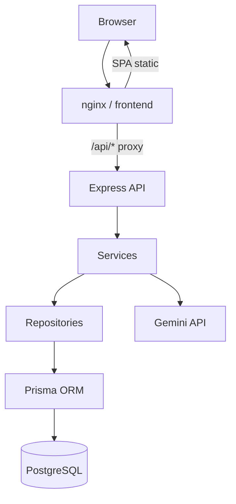
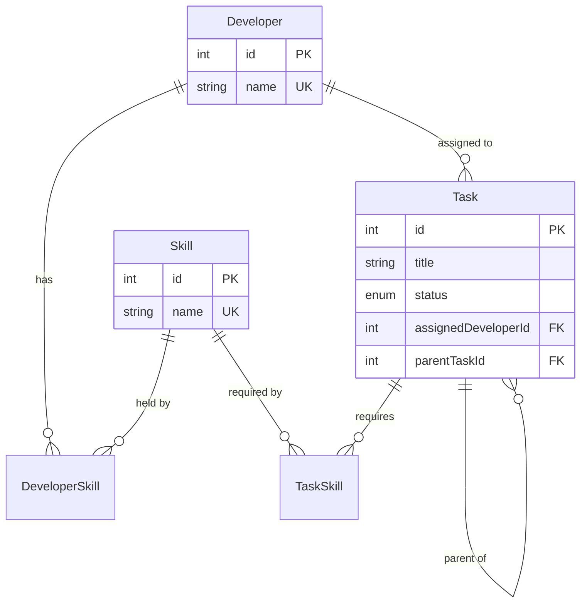

# Task Manager — Full Stack Take-Home Assignment

A production-style task management application for assigning developers to tasks based on skills, with unlimited nested subtasks and optional Gemini-powered skill inference.

## Tech Stack

| Layer | Technologies |
|-------|--------------|
| Frontend | React, TypeScript, Vite, React Router, TanStack Query, React Hook Form, Axios, Tailwind CSS |
| Backend | Node.js, Express, TypeScript, Prisma, PostgreSQL, Zod |
| LLM | Google Gemini API or OpenAI-compatible APIs (e.g. OpenRouter / DeepSeek) |
| Infrastructure | Docker, Docker Compose, nginx |

## Architecture



### Backend layering

```
Routes → Controllers → Services → Repositories → Prisma → PostgreSQL
```

- **Controllers** — HTTP I/O, validation wiring, response formatting
- **Services** — business rules (skill matching, parent DONE gate, Gemini inference)
- **Repositories** — database access only

### Frontend structure

- **Pages** — route-level composition
- **Components** — reusable UI and task-specific widgets
- **Hooks** — TanStack Query data fetching and mutations
- **Services** — typed Axios API client

## ER Diagram



## Business Rules

| Rule | Description |
|------|-------------|
| **R1** | A task can only be assigned to a developer who has **all** required skills |
| **R2** | Task status can be updated (`TODO`, `IN_PROGRESS`, `DONE`) |
| **R3** | A parent task cannot become `DONE` until every descendant is `DONE` |
| **R4** | All rules are enforced by the backend; the frontend displays API errors |

## Folder Structure

```
htx-assignment/
├── backend/
│   ├── prisma/          # schema, migrations, seed
│   └── src/
│       ├── config/
│       ├── controllers/
│       ├── middleware/
│       ├── repositories/
│       ├── routes/
│       ├── services/
│       ├── types/
│       ├── utils/
│       └── validators/
├── frontend/
│   └── src/
│       ├── components/
│       ├── hooks/
│       ├── pages/
│       ├── routes/
│       ├── services/
│       ├── types/
│       └── utils/
├── docker-compose.yml
└── README.md
```

## Prerequisites

- Node.js 22+
- npm
- Docker & Docker Compose (for containerized setup)
- PostgreSQL 16 (for local backend development without Docker)

## Quick Start (Docker)

```bash
cp .env.example .env
# Optional: set GEMINI_API_KEY in .env for skill inference

docker compose up --build
```

| Service | URL |
|---------|-----|
| Frontend | http://localhost |
| Backend API | http://localhost:3000/api |
| Health check | http://localhost:3000/health |

Docker Compose will:

1. Start PostgreSQL
2. Run Prisma migrations
3. Seed developers and skills
4. Start the backend
5. Build and serve the frontend via nginx (proxies `/api` to backend)

## Local Development (without Docker)

### 1. Database

```bash
docker compose up -d postgres
# or use a local PostgreSQL instance
```

### 2. Backend

```bash
cd backend
cp .env.example .env
npm install
npm run migrate:deploy
npm run seed
npm run dev
```

Backend runs at http://localhost:3000

### 3. Frontend

```bash
cd frontend
cp .env.example .env
npm install
npm run dev
```

Frontend runs at http://localhost:5173

## Environment Variables

### Root / Docker Compose (`.env`)

| Variable | Description | Default |
|----------|-------------|---------|
| `POSTGRES_USER` | Database user | `taskapp` |
| `POSTGRES_PASSWORD` | Database password | `taskapp_secret` |
| `POSTGRES_DB` | Database name | `taskapp` |
| `LLM_PROVIDER` | Skill inference provider (`gemini` or `openai`) | `gemini` |
| `GEMINI_API_KEY` | Google Gemini API key (when `LLM_PROVIDER=gemini`) | empty |
| `GEMINI_MODEL` | Gemini model name | `gemini-2.0-flash` |
| `OPENAI_API_KEY` | OpenAI-compatible API key (when `LLM_PROVIDER=openai`) | empty |
| `OPENAI_BASE_URL` | OpenAI-compatible base URL | `https://openrouter.ai/api/v1` |
| `OPENAI_MODEL` | OpenAI-compatible model | `deepseek/deepseek-r1:free` |
| `OPENAI_HTTP_REFERER` | Optional referer header for OpenRouter | empty |
| `OPENAI_APP_NAME` | Optional app name header for OpenRouter | empty |
| `CORS_ORIGIN` | Allowed origins (comma-separated) | `http://localhost,http://localhost:5173` |
| `RUN_SEED` | Seed DB on backend container start | `true` |

### Backend (`backend/.env`)

| Variable | Description |
|----------|-------------|
| `DATABASE_URL` | PostgreSQL connection string |
| `PORT` | Server port (default `3000`) |
| `CORS_ORIGIN` | Comma-separated allowed origins |
| `LLM_PROVIDER` | Skill inference provider (`gemini` or `openai`) |
| `GEMINI_API_KEY` | Required when `LLM_PROVIDER=gemini` |
| `GEMINI_MODEL` | Gemini model identifier |
| `OPENAI_API_KEY` | Required when `LLM_PROVIDER=openai` |
| `OPENAI_BASE_URL` | OpenAI-compatible API base URL |
| `OPENAI_MODEL` | Model name (e.g. `deepseek/deepseek-r1:free` via OpenRouter) |

### Frontend (`frontend/.env`)

| Variable | Description |
|----------|-------------|
| `VITE_API_BASE_URL` | API base URL (`http://localhost:3000/api` for local dev; `/api` in Docker) |

## API Documentation

Base URL: `/api`

### Response envelope

**Success:**
```json
{ "success": true, "data": {} }
```

**Error:**
```json
{
  "success": false,
  "error": {
    "message": "Human-readable summary",
    "code": "NOT_FOUND",
    "details": [{ "path": "body.title", "message": "Required" }]
  }
}
```

### Tasks

#### `GET /tasks`
List root tasks with nested subtask trees.

Query: `?status=TODO|IN_PROGRESS|DONE` (optional)

#### `GET /tasks/:id`
Get a single task with its subtree.

#### `POST /tasks`
Create a task tree.

```json
{
  "title": "Full stack feature",
  "skillIds": [1, 2],
  "subtasks": [
    {
      "title": "Build API",
      "skillIds": [2]
    }
  ]
}
```

- Omit `skillIds` (or send `[]`) to trigger LLM skill inference per node
- If inference fails, the request returns `422` and no task is created

#### `PATCH /tasks/:id`
Update status and/or assignment.

```json
{
  "status": "DONE",
  "assignedDeveloperId": 3
}
```

Set `"assignedDeveloperId": null` to unassign.

### Developers

#### `GET /developers`
List all developers with skills.

#### `GET /developers/:id`
Get a single developer.

### Skills

#### `GET /skills`
List all skills.

### Health

#### `GET /health`
Returns `{ status: "ok" }`.

## Seed Data

| Developer | Skills |
|-----------|--------|
| Alice | Frontend |
| Bob | Backend |
| Carol | Frontend, Backend |
| Dave | Backend |

## LLM Integration

Skill inference uses a pluggable provider selected by `LLM_PROVIDER`:

| Provider | Env | Example model |
|----------|-----|---------------|
| `gemini` | `GEMINI_API_KEY`, `GEMINI_MODEL` | `gemini-2.0-flash` |
| `openai` | `OPENAI_API_KEY`, `OPENAI_BASE_URL`, `OPENAI_MODEL` | `deepseek/deepseek-r1:free` (OpenRouter) |

When creating a task **without** required skills, the backend prompts the configured LLM:

```
Given this task title: "{title}"
Return ONLY one of: Frontend | Backend | Frontend,Backend
No explanation.
```

- Parsed skills are stored in the database
- If inference fails or the provider API key is missing, the API returns `422` with an error message

### Switching providers

**OpenRouter / DeepSeek (recommended free tier):**
```env
LLM_PROVIDER=openai
OPENAI_API_KEY=your_openrouter_key
OPENAI_BASE_URL=https://openrouter.ai/api/v1
OPENAI_MODEL=deepseek/deepseek-r1:free
```

**Gemini:**
```env
LLM_PROVIDER=gemini
GEMINI_API_KEY=your_gemini_key
GEMINI_MODEL=gemini-2.0-flash-lite
```

Restart the backend after changing provider settings.

## Tradeoffs

| Decision | Rationale | Tradeoff |
|----------|-----------|----------|
| Layered backend | Clear separation of concerns | More files than a monolith |
| Recursive POST for nested tasks | Single atomic create | Complex validation |
| Gemini on create only | Spec requirement; fast reads | External dependency |
| Pluggable LLM providers | Easy switch between Gemini and OpenAI-compatible APIs | Two sets of env vars to document |
| nginx API proxy in Docker | Same-origin `/api`, no CORS issues in production | Differs from local dev URL setup |
| Backend-only business rules | Single source of truth | Frontend shows errors after invalid actions |
| Load-all-tasks for tree reads | Simple for take-home scope | Not ideal for very large datasets |

## Future Improvements

- Authentication and authorization
- Pagination and filtering for task lists
- WebSocket or SSE for live updates
- Shared types package between frontend and backend
- Optimistic UI updates with rollback
- Recursive CTE for descendant checks instead of loading all tasks
- Rate limiting and request logging
- E2E tests (Playwright) and API integration tests
- CI pipeline with lint, test, and Docker build

## Suggested Commit History

```
chore: initialize project structure and docker compose
feat(backend): add prisma schema, migrations, and seed data
feat(backend): implement read APIs
feat(backend): implement task creation with nested subtasks
feat(backend): enforce assignment and status business rules
feat(backend): integrate gemini skill inference
feat(frontend): scaffold app with routing and data fetching
feat(frontend): implement task list with assign and status update
feat(frontend): implement recursive task creation form
docs: add comprehensive README and docker frontend service
```

## License

Private — take-home assignment.
